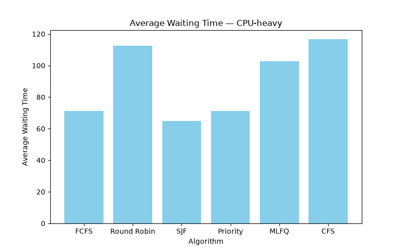
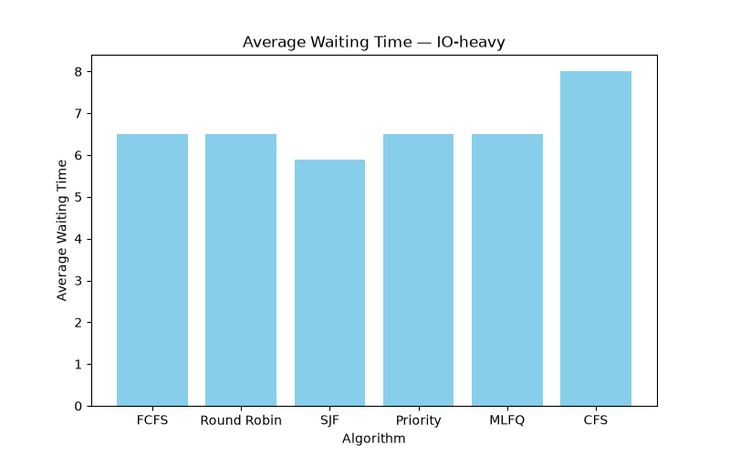
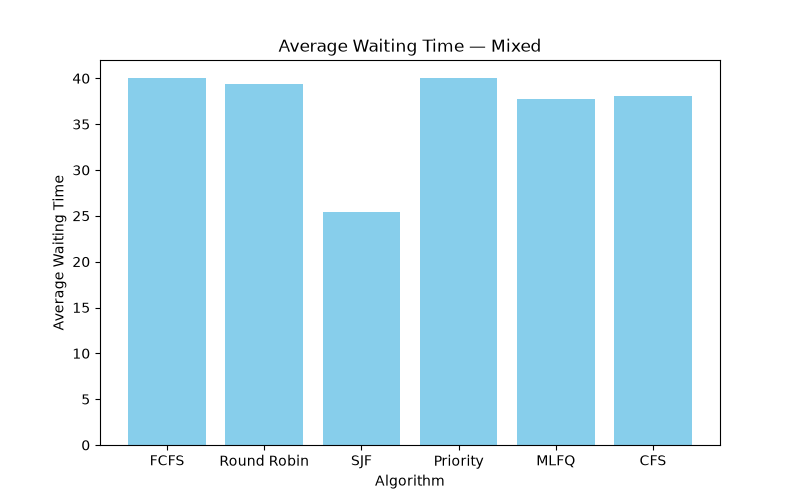

# CPU Scheduling Simulator

A Python simulator implementing and comparing 6 classic CPU scheduling algorithms built to understand how operating systems actually decide which process runs next.

## Why I built this

I'm a CS student interested in Linux internals and how the kernel really works under the hood. Instead of just reading about scheduling algorithms, I wanted to implement them from scratch, test them against synthetic workloads, and see the tradeoffs for myself.

## Algorithms Implemented

- **FCFS** (First Come First Served) — runs processes strictly in arrival order
- **Round Robin** — time-sliced, cycles through processes fairly
- **SJF** (Shortest Job First) — always runs the shortest available job next
- **Priority Scheduling** — runs the highest-priority available process
- **MLFQ** (Multi-Level Feedback Queue) — multiple priority queues, processes demoted if they use their full time slice
- **CFS (simplified)** — inspired by Linux's actual scheduler, tracks "virtual runtime" and always runs whoever has had the least CPU time so far

## Sample Results

### CPU-heavy workload


### I/O-heavy workload


### Mixed workload


## Key Findings

- **SJF consistently had the lowest average waiting time** on CPU-heavy and mixed workloads — expected, since it's mathematically optimal for minimizing average wait (though it requires knowing burst time in advance, which isn't realistic for a real OS).
- **Round Robin and CFS performed worse on CPU-heavy workloads** — constant time-slicing means long jobs take longer to finish overall, even though it keeps things fair.
- **On I/O-heavy workloads, all algorithms performed similarly** — when burst times are short, the choice of scheduler matters far less.
- **MLFQ and CFS don't need to know burst time in advance** (unlike SJF/Priority), making them far more realistic for how a real OS actually operates, since burst time isn't knowable ahead of time.

## How to Run

```bash
python3 main.py      # runs full comparison across all algorithms and workloads
python3 charts.py    # generates comparison charts as PNG files
```

## What I'd Improve With More Time

- Add proper `nice`-value weighting to the CFS implementation (real CFS weights vruntime growth by priority)
- Generate larger, more varied synthetic workloads
- Add a proper report of average CPU utilization, not just waiting/turnaround time
